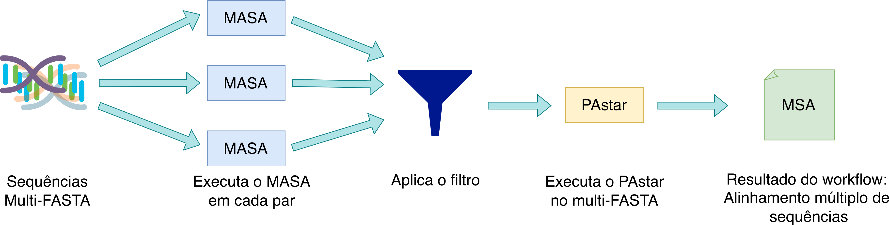

# Workflow MASA-OPENMP PASTAR

O _workflow_ científico apresentado neste repositório tem como propósito realizar o alinhamento múltiplo de sequências de um subconjunto utilizado como entrada.

Para isso, estão acoplados ao _workflow_ dois programas exatos para alinhamento de sequências, sendo eles:

1. [MASA-OPENMP](https://github.com/edanssandes/MASA-OpenMP)
1. [PA-star](https://github.com/danielsundfeld/astar_msa)


A figura abaixo apresenta o funcionamento do _workflow_. A entrada é composta por um arquivo multi-FASTA, contendo várias sequências. Essas sequências são decompostas em arquivos individuais e é realizada a execução do MASA em cada par possível da combinação de sequências. Os resutlados dos MASAs são sumarizados e um subconjunto de sequências é filtrado. A partir das sequências seleciondas, o PA-star é executado, gerando um alinhamento múltiplo de sequências desse subconjunto.




O _workflow_ apresenta duas versões. A primeira desenvolvida sem nenhum sistema de gerência de _workflows_ científicos, que pode ser encontrada [aqui](./experiments/wf_wo_pycompss/main.sh). A segunda versão, foi desenvolvida utilizando o sistema de gerência de _workflows_ científicos PyCOMPSs, e se encontra na pasta [src](./src/main.py).

## Requisitos

O _workflow_ tem como requisitos os seguintes programas e bibliotecas:

 * MASA-OPENMP v1.0.1.1024
 * PA-star2 v2.0
 * Python $\geq$ v3.11.7
 * PyCOMPSs $\geq$ v3.3.3
 * BioPython $\geq$ v1.85

## Uso

O script deve ser executado a partir da linha de comando da seguinte forma:

```bash
python script.py -i <arquivo_fasta> [opções]
```

## Argumentos de Linha de Comando

### Argumentos Obrigatórios

* **`-i`, `--input`** (`str`, obrigatório)

  Caminho para o arquivo multi-FASTA de entrada contendo as sequências a serem analisadas.

### Argumentos Opcionais

* **`-w`, `--workdir`** (`str`, opcional, padrão: diretório de trabalho atual)

  Diretório de trabalho (caminho absoluto) onde todos os arquivos de saída gerados pelo workflow serão armazenados.

* **`-m`, `--max_seqs`** (`int`, opcional, padrão: `5`)

  Número máximo de sequências que serão selecionadas e submetidas à etapa de alinhamento múltiplo de sequências utilizando o Pastar.

* **`-p`, `--pastar_threads`** (`int`, opcional, padrão: `1`)

  Número de threads a serem utilizadas pelo Pastar durante o processo de alinhamento.

* **`-s`, `--similar` / `--no-similar`** (`bool`, opcional, padrão: `False`)

  Estratégia de seleção das sequências:

  * Quando habilitado (`--similar`), o workflow seleciona as sequências mais similares.
  * Quando omitido ou desabilitado (`--no-similar`, comportamento padrão), o workflow seleciona as sequências mais divergentes.

## Exemplo

```bash
python script.py \
  --input sequences.fasta \
  --workdir /results/ \
  --max_seqs 10 \
  --pastar_threads 4 \
  --similar
```

Esse comando seleciona até 10 sequências similares a partir de `sequences.fasta`, executa o Pastar utilizando 4 threads e armazena todos os resultados no diretório `./results/`.

